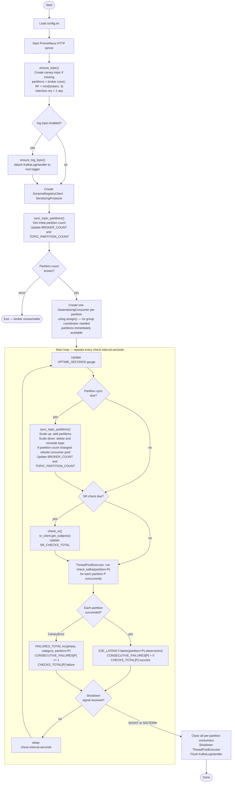
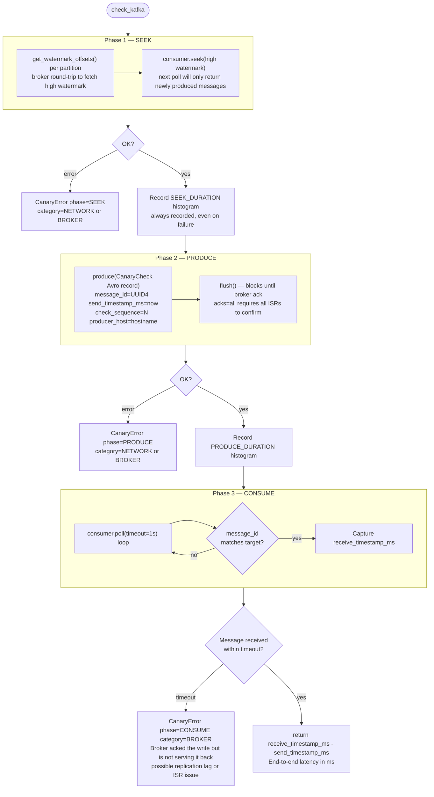
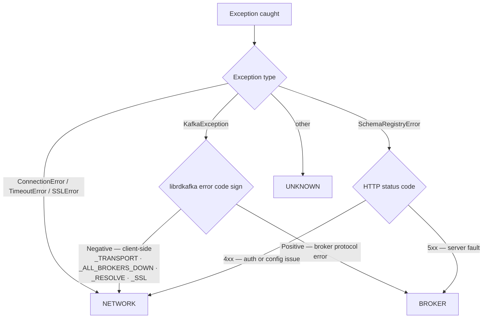

# cloud_canary

A production-grade Kafka canary that continuously measures the end-to-end health
of a [Confluent Cloud](https://confluent.cloud) cluster. It produces a small
Avro-encoded message, consumes it back, and records the round-trip latency and any
errors as Prometheus metrics — giving you an always-on signal of cluster availability,
replication health, and network connectivity.

---

## Quick Start

```bash
# 1. Create and activate a virtual environment
python3 -m venv .venv && source .venv/bin/activate   # Windows: .venv\Scripts\activate

# 2. Install dependencies
pip install -r requirements.txt

# 3. Configure credentials
cp config/config.ini.template config/config.ini
# Edit config/config.ini — fill in bootstrap.servers, sasl.username/password,
# schema_registry url, and basic.auth.user.info

# 4. Run the canary (from project root)
python -m src.main

# 5. (Optional) Start Prometheus + Grafana monitoring stack alongside the canary
#    run.sh starts Colima if needed, brings up the monitoring stack, runs the canary,
#    and tears the stack down cleanly on exit.
./run.sh
# Prometheus: http://localhost:9090   Grafana: http://localhost:3000 (admin/admin)
```

> `config/config.ini` is git-ignored — never commit it.

---

## Table of Contents

1. [What It Does](#what-it-does)
2. [How It Works](#how-it-works)
   - [Main Loop](#main-loop)
   - [check_kafka Phases](#check_kafka-phases)
   - [Error Classification](#error-classification)
3. [Project Structure](#project-structure)
4. [Prerequisites](#prerequisites)
5. [Setup](#setup)
6. [Configuration Reference](#configuration-reference)
7. [Running the Canary](#running-the-canary)
8. [Running Multiple Instances](#running-multiple-instances)
9. [Prometheus Metrics](#prometheus-metrics)
10. [Monitoring Stack](#monitoring-stack-prometheus--grafana)
11. [Troubleshooting](#troubleshooting)

---

## What It Does

| Capability | Detail |
|---|---|
| **End-to-end latency** | Measures produce → broker ack → consumer receive round-trip in ms, per partition |
| **Per-broker coverage** | One check per partition runs concurrently every cycle — every broker leader is exercised |
| **Phase attribution** | Distinguishes failures in the SEEK, PRODUCE, and CONSUME phases |
| **Error classification** | Labels failures as NETWORK (client-side) or BROKER (server-side) |
| **Topic management** | Auto-creates the canary topic; resizes partitions when the cluster scales |
| **Schema Registry health** | Independently probes SR on its own cadence |
| **Prometheus metrics** | Exposes latency histograms, counters, and gauges at `/metrics` |
| **Kafka log capture** | Optionally publishes all canary logs to a Kafka topic for long-term retention |
| **Grafana dashboard** | Pre-built dashboard provisioned automatically via Docker Compose |
| **Multi-instance safe** | Multiple instances run concurrently without interfering — each uses a unique consumer group and `host`-labelled metrics |

---

## How It Works

### Main Loop

The canary runs three independent check cadences in a single-threaded loop:



### check_kafka Phases

Each check runs three sequential phases. The duration of SEEK and PRODUCE are timed
independently so you can isolate where latency is coming from.



> **Why a CONSUME timeout implies a broker fault:** by the time CONSUME starts,
> the produce already succeeded with `acks=all`. The broker confirmed the write to
> all in-sync replicas. A timeout here therefore means the broker is not serving
> the message back — not that it was lost.

### Error Classification

Every failure is labelled by the phase where it occurred and classified into one of
two categories based on where the error originated.



| Category | Meaning | Examples |
|---|---|---|
| **NETWORK** | Client could not reach the endpoint (TCP / DNS / TLS layer) | Broker unreachable, DNS failure, expired TLS cert, VPN drop |
| **BROKER** | Broker received the request but returned an error | ISR degradation, quota exceeded, leader not available |
| **UNKNOWN** | Could not be classified | Unexpected exception type |

---

## Project Structure

```
cloud_canary/
├── config/
│   ├── config.ini              # Your credentials — git-ignored, never commit this
│   └── config.ini.template     # Checked-in template with all available options
│
├── monitoring/                 # Local Prometheus + Grafana stack
│   ├── docker-compose.yml
│   ├── prometheus/
│   │   └── prometheus.yml      # Scrape config pointing at host:8000
│   └── grafana/
│       ├── provisioning/
│       │   ├── datasources/
│       │   │   └── prometheus.yml    # Auto-wires Prometheus as default datasource
│       │   └── dashboards/
│       │       └── provider.yml      # Tells Grafana where to load dashboards from
│       └── dashboards/
│           └── cloud_canary.json     # Pre-built dashboard, loaded automatically
│
├── src/
│   ├── __init__.py
│   ├── config.py               # INI loader — returns kafka / schema_registry / app dicts
│   ├── consumer.py             # DeserializingConsumer, seek_to_end(), consume_canary()
│   ├── error_classifier.py     # Phase enum, ErrorCategory enum, CanaryError exception
│   ├── kafka_log_handler.py    # logging.Handler that publishes JSON records to Kafka
│   ├── main.py                 # Entry point: startup, main loop, signal handling
│   ├── metrics.py              # All Prometheus metric definitions
│   ├── producer.py             # SerializingProducer, produce_canary()
│   ├── schema.py               # Avro schema string, CanaryMessage dataclass
│   └── topic.py                # ensure_topic(), sync_topic_partitions()
│
├── .gitignore
├── requirements.txt
├── run.sh                      # Convenience script: starts monitoring stack + canary together
└── README.md
```

---

## Prerequisites

| Requirement | Notes |
|---|---|
| Python **3.10+** | Required — the code uses `X \| Y` union syntax introduced in 3.10. `python3 --version` to check. |
| pip | Comes with Python |
| A Confluent Cloud cluster | Dedicated or Basic tier both work |
| Kafka API key + secret | Needs `TOPIC:CREATE`, `TOPIC:WRITE`, `TOPIC:READ` ACLs on `cloud-canary*` |
| Schema Registry API key + secret | Needs `SUBJECT:READ` and `SUBJECT:WRITE` on `com.cloud.canary*` |
| Docker + Docker Compose V2 | Only required for the optional monitoring stack. Uses `docker compose` (space, not hyphen). **macOS:** install [Colima](https://github.com/abiosoft/colima) (`brew install colima docker docker-compose`) or Docker Desktop. **Linux:** install the Compose plugin: `apt install docker-compose-plugin`. |

---

## Setup

### 1. Create and activate a virtual environment

```bash
cd cloud_canary/
python3 -m venv .venv
source .venv/bin/activate        # Windows: .venv\Scripts\activate
```

### 2. Install dependencies

```bash
pip install -r requirements.txt
```

`requirements.txt` installs:
- `confluent-kafka[avro]` — librdkafka Python bindings with Avro/Schema Registry support
- `prometheus_client` — Prometheus metrics HTTP server

> **Linux note:** `confluent-kafka` bundles `librdkafka` in the wheel for most x86_64
> Linux distributions. On ARM Linux (Graviton, Raspberry Pi, etc.) pip may attempt to
> build from source, which requires `librdkafka-dev` and a C compiler:
> ```bash
> # Debian/Ubuntu
> sudo apt install librdkafka-dev build-essential
> # RHEL/Amazon Linux
> sudo yum install librdkafka-devel gcc
> ```
> On macOS and Windows the wheel is always pre-built — no extra steps needed.

### 3. Configure credentials

```bash
cp config/config.ini.template config/config.ini
```

Open `config/config.ini` and fill in your Confluent Cloud credentials:

```ini
[kafka]
bootstrap.servers=pkc-xxxxx.us-east-1.aws.confluent.cloud:9092
security.protocol=SASL_SSL
sasl.mechanisms=PLAIN
sasl.username=YOUR_KAFKA_API_KEY
sasl.password=YOUR_KAFKA_API_SECRET

[schema_registry]
url=https://psrc-xxxxx.us-east-2.aws.confluent.cloud
basic.auth.user.info=SR_API_KEY:SR_API_SECRET

[app]
topic=cloud-canary
consumer.timeout.seconds=5
check.interval.seconds=15
```

> `config/config.ini` is listed in `.gitignore`. **Never commit it.**

---

## Configuration Reference

### `[kafka]` — librdkafka connection and authentication

These keys are passed directly to the librdkafka client. Key names must match
[librdkafka's configuration properties](https://github.com/confluentinc/librdkafka/blob/master/CONFIGURATION.md) exactly.

| Key | Required | Description |
|---|---|---|
| `bootstrap.servers` | Yes | Confluent Cloud bootstrap endpoint (`pkc-xxxxx...confluent.cloud:9092`) |
| `security.protocol` | Yes | Must be `SASL_SSL` for Confluent Cloud |
| `sasl.mechanisms` | Yes | Must be `PLAIN` for Confluent Cloud |
| `sasl.username` | Yes | Kafka API key |
| `sasl.password` | Yes | Kafka API secret |

### `[schema_registry]` — Confluent Schema Registry

| Key | Required | Description |
|---|---|---|
| `url` | Yes | Schema Registry endpoint (`https://psrc-xxxxx...confluent.cloud`) |
| `basic.auth.user.info` | Yes | `SR_API_KEY:SR_API_SECRET` (colon-separated) |

### `[app]` — Canary behaviour

| Key | Default | Description |
|---|---|---|
| `topic` | `cloud-canary` | Kafka topic used for canary messages. Created automatically at startup. |
| `consumer.timeout.seconds` | `5` | Max seconds to wait for the canary message before treating the consume phase as failed. |
| `check.interval.seconds` | `15` | Seconds between consecutive end-to-end checks. |
| `partition.sync.interval.seconds` | `86400` | How often to check for broker count changes and resize the topic. |
| `sr.check.interval.seconds` | `60` | How often to run an independent Schema Registry health probe. |
| `instance.id` | *hostname* | Unique identifier for this canary instance. Defaults to the system hostname. Override when running multiple instances on the same host or when you want consistent labels across container restarts. Can also be set via `CANARY_INSTANCE_ID` environment variable (takes precedence). |
| `metrics.port` | `8000` | TCP port for the Prometheus `/metrics` HTTP endpoint. |
| `metrics.bind.address` | `0.0.0.0` | IP address to bind the metrics HTTP server to. Use `0.0.0.0` for all interfaces (default), `127.0.0.1` for localhost only, or a specific IP to bind to a single network interface. |
| `metrics.ssl.enabled` | `false` | Enable HTTPS/TLS for the metrics endpoint. Requires `metrics.ssl.cert` and `metrics.ssl.key` to be configured. Useful for production environments where metrics contain sensitive labels. |
| `metrics.ssl.cert` | — | Path to SSL certificate file in PEM format. Required when `metrics.ssl.enabled=true`. |
| `metrics.ssl.key` | — | Path to SSL private key file in PEM format. Required when `metrics.ssl.enabled=true`. |
| `log.topic.enabled` | `false` | Set to `true` to publish all canary logs as JSON to a Kafka topic. |
| `log.topic` | `cloud-canary-logs` | Topic name for log capture. Created automatically if enabled. |
| `log.topic.retention.ms` | `604800000` | Log topic retention period in milliseconds (default: 7 days). |
| `warmup.checks` | `2` | Number of initial checks whose E2E latency is measured but not recorded to `canary_e2e_latency_ms`. Suppresses cold-start inflation (TCP/TLS, metadata fetch, SR schema registration). Set to `0` to disable warmup and record all observations. |

> **Canary topic retention** is fixed at **1 day (86400000 ms)** and is not configurable via `config.ini`. It is set at topic creation time. If the topic already exists, update it manually:
> ```bash
> confluent kafka topic update cloud-canary --config retention.ms=86400000
> ```

---

## Running the Canary

### Local Development (Python Virtual Environment)

```bash
# From the project root, with the virtual environment active:
python -m src.main
```

Alternatively, `run.sh` starts the monitoring stack and the canary together, and tears down the stack on exit:

```bash
# Use default instance ID (hostname)
./run.sh

# Specify custom instance ID
./run.sh canary-dev-1

# Or use environment variable
CANARY_INSTANCE_ID=my-canary ./run.sh
```

### Docker Deployment (Recommended for Production)

```bash
# Build the Docker image
docker build -t cloud-canary:latest .

# Run with mounted config file
docker run --rm \
  -v $(pwd)/config/config.ini:/app/config/config.ini:ro \
  -p 8000:8000 \
  cloud-canary:latest

# Run with custom instance ID (for multi-instance deployments)
docker run --rm \
  -e CANARY_INSTANCE_ID=canary-us-east-1 \
  -v $(pwd)/config/config.ini:/app/config/config.ini:ro \
  -p 8000:8000 \
  cloud-canary:latest

# Run in background (detached mode)
docker run -d \
  --name cloud-canary \
  --restart unless-stopped \
  -v $(pwd)/config/config.ini:/app/config/config.ini:ro \
  -p 8000:8000 \
  cloud-canary:latest

# View logs
docker logs -f cloud-canary

# Stop the container
docker stop cloud-canary
```

**Docker Compose example:**

```yaml
version: '3.8'
services:
  cloud-canary:
    image: cloud-canary:latest
    build: .
    container_name: cloud-canary
    restart: unless-stopped
    environment:
      - CANARY_INSTANCE_ID=canary-prod-1
    volumes:
      - ./config/config.ini:/app/config/config.ini:ro
    ports:
      - "8000:8000"
    healthcheck:
      test: ["CMD", "python", "-c", "import urllib.request; urllib.request.urlopen('http://localhost:8000/metrics')"]
      interval: 30s
      timeout: 5s
      retries: 3
```

### Log output format

```
2024-06-10T12:00:00 [INFO] cloud_canary started | topic=cloud-canary check.interval=15s ... warmup.checks=2
2024-06-10T12:00:00 [INFO] Metrics available at http://0.0.0.0:8000/metrics
2024-06-10T12:00:00 [INFO] Cluster has 3 broker(s).
2024-06-10T12:00:00 [INFO] Topic 'cloud-canary' already exists (3 partition(s)) — skipping creation.
2024-06-10T12:00:00 [INFO] Running initial partition sync...
2024-06-10T12:00:01 [INFO] Per-partition consumers ready: 3 partition(s) → [0, 1, 2]
2024-06-10T12:00:01 [INFO] SR OK
2024-06-10T12:00:01 [INFO] Produced  | seq=1 partition=0 id=3f2a1c7e-... host=my-host
2024-06-10T12:00:01 [INFO] Produced  | seq=1 partition=1 id=9a4b2d1f-... host=my-host
2024-06-10T12:00:01 [INFO] Produced  | seq=1 partition=2 id=c7e3a8b2-... host=my-host
2024-06-10T12:00:01 [INFO] WARMUP    | seq=1 partition=0 latency=312ms (not recorded)
2024-06-10T12:00:01 [INFO] WARMUP    | seq=1 partition=1 latency=298ms (not recorded)
2024-06-10T12:00:01 [INFO] WARMUP    | seq=1 partition=2 latency=341ms (not recorded)
2024-06-10T12:00:16 [INFO] WARMUP    | seq=2 partition=0 latency=94ms (not recorded)
2024-06-10T12:00:16 [INFO] WARMUP    | seq=2 partition=1 latency=88ms (not recorded)
2024-06-10T12:00:16 [INFO] WARMUP    | seq=2 partition=2 latency=91ms (not recorded)
2024-06-10T12:00:16 [INFO] Warmup complete — latency metrics enabled from the next check.
2024-06-10T12:00:31 [INFO] Consumed  | seq=3 partition=0 latency=87ms
2024-06-10T12:00:31 [INFO] Consumed  | seq=3 partition=1 latency=92ms
2024-06-10T12:00:31 [INFO] Consumed  | seq=3 partition=2 latency=85ms
2024-06-10T12:00:31 [INFO] Next check in 15s

# On failure (partition 1 only — broker 1 degraded):
2024-06-10T12:02:02 [ERROR] FAIL [1] | seq=5 partition=1 phase=PRODUCE category=NETWORK detail=...
2024-06-10T12:02:02 [INFO]  Next check in 15s
```

| Log line | Meaning |
|---|---|
| `Per-partition consumers ready: N partition(s) → [0..N-1]` | Startup complete; one consumer assigned per partition |
| `Produced \| seq=K partition=P id=...` | Canary message sent to partition P |
| `WARMUP \| seq=N partition=P latency=Xms (not recorded)` | Warmup check succeeded; latency measured but not recorded to Prometheus |
| `Warmup complete — latency metrics enabled from the next check.` | Warmup period finished; all subsequent E2E latency observations are recorded |
| `Consumed \| seq=N partition=P latency=Xms` | Check succeeded; latency recorded to Prometheus for this partition |
| `FAIL [N] \| seq=M partition=P phase=PH category=C` | Check failed on partition P; `N` = consecutive failure count for that partition |
| `SR OK` | Schema Registry probe succeeded |
| `SR FAIL \| ...` | Schema Registry probe failed |

### Graceful shutdown

Send `SIGINT` (Ctrl-C) or `SIGTERM` (container stop). The canary finishes the
current check, closes the consumer cleanly (leaves the group), flushes any buffered
log records to Kafka, then exits.

```bash
# Ctrl-C in the terminal, or:
kill -SIGTERM <pid>
```

---

## Running Multiple Instances

Multiple instances of the canary can run concurrently — for example, one per region or
one per host — without interfering with each other. The following concerns have all been
addressed:

### Independent produce/consume

Each instance uses a randomly generated UUID as its Kafka consumer group ID, so consumer
groups never overlap. Canary messages are matched by the UUID embedded in each message, so
a message produced by instance A is never mistaken for a message produced by instance B.

### Topic management collisions

Topic creation and partition sync operations are safe to run concurrently from multiple
instances:

| Operation | Race condition | How it's handled |
|---|---|---|
| `ensure_topic()` at startup | Two instances both see the topic missing and call `create_topics()` | The second instance receives `TOPIC_ALREADY_EXISTS` and treats it as success |
| `ensure_log_topic()` at startup | Same as above | Same handling |
| `sync_topic_partitions()` scale-up | Two instances call `create_partitions()` simultaneously | The failing instance re-fetches metadata; if the partition count is already correct it logs and skips |
| `sync_topic_partitions()` scale-down delete | Two instances both try to delete the topic | The second `delete_topics()` call returns `UNKNOWN_TOPIC_OR_PART`; the instance falls through to the propagation wait |
| `sync_topic_partitions()` scale-down recreate | During propagation wait, the topic reappears (another instance recreated it) | If the reappeared topic has the correct partition count, recreation is skipped |

### Metrics port

Each instance must use a distinct `metrics.port` so the Prometheus HTTP servers do not
conflict. Configure this in each instance's `config.ini`:

```ini
# Instance 1
metrics.port=8000

# Instance 2
metrics.port=8001
```

### Distinguishing instances in Prometheus and Grafana

Every metric carries a `host` label set to `socket.gethostname()` at startup. Filter or
aggregate by instance using this label:

```promql
# Show only instance on host "us-east-canary"
canary_consecutive_failures{host="us-east-canary"}

# Compare consecutive failures across all instances
canary_consecutive_failures
```

If multiple instances run on the same physical host with the same hostname, set a unique
identifier using one of these methods:

**Method 1: Environment variable (recommended for Docker/Kubernetes)**
```bash
CANARY_INSTANCE_ID=canary-us-east python -m src.main &
CANARY_INSTANCE_ID=canary-eu-west python -m src.main &

# Docker example
docker run -e CANARY_INSTANCE_ID=canary-prod-1 ...
```

**Method 2: Configuration file**
```ini
# config/config.ini
[app]
instance.id=canary-us-east-1
```

Note: `CANARY_INSTANCE_ID` environment variable takes precedence over `instance.id` in config.ini.

---

## Prometheus Metrics

The canary exposes metrics at `http://localhost:8000/metrics` (port configurable).

> **`host` label** — Every metric carries a `host` label set to `socket.gethostname()` at
> startup. This makes every time series unambiguously tied to the specific canary instance
> that produced it, which is essential when multiple instances run concurrently.

### Latency histograms

All latency histograms carry `host` and `partition` labels. Each partition corresponds
to a distinct broker leader, giving per-broker latency attribution.

| Metric | Description | Bucket boundaries (ms) |
|---|---|---|
| `canary_e2e_latency_ms` | End-to-end latency per partition check (produce timestamp → consumer receive) | 10 25 50 100 250 500 1000 2500 5000 10000 |
| `canary_seek_duration_ms` | Time to fetch high-watermark offset and seek the partition | 1 5 10 25 50 100 250 500 |
| `canary_produce_duration_ms` | Time from `produce()` call to broker ack (`flush` return) | 5 10 25 50 100 250 500 1000 2500 |

### Counters

| Metric | Labels | Description |
|---|---|---|
| `canary_checks_total` | `result` (`success`\|`failure`), `host`, `partition` | Total check attempts per partition |
| `canary_failures_total` | `phase`, `category`, `host`, `partition` | Failed checks by phase, error category, and partition |
| `canary_sr_checks_total` | `result` (`success`\|`failure`), `host` | Schema Registry health check attempts |

### Gauges

| Metric | Labels | Description |
|---|---|---|
| `canary_consecutive_failures` | `host`, `partition` | Current streak of consecutive failures per partition — **primary alerting signal** |
| `canary_last_success_timestamp_seconds` | `host`, `partition` | Unix timestamp of the last successful check per partition — **staleness detection**. Alert when `(now - value) > threshold` to detect broken monitoring |
| `canary_broker_count` | `host` | Broker count as of the last partition sync |
| `canary_topic_partition_count` | `host` | Canary topic partition count as of the last partition sync |
| `canary_uptime_seconds` | `host` | Seconds since the canary process started |
| `canary_check_sequence` | `host` | Sequence number of the last check cycle — gaps indicate restarts |

### Useful PromQL queries

```promql
# Check success rate over the last 5 minutes for a specific host (all partitions)
sum(rate(canary_checks_total{result="success", host="my-host"}[5m]))
  / sum(rate(canary_checks_total{host="my-host"}[5m])) * 100

# Check success rate across all instances and partitions
sum by (host, partition) (rate(canary_checks_total{result="success"}[5m]))
  / sum by (host, partition) (rate(canary_checks_total[5m])) * 100

# p95 end-to-end latency per broker partition
histogram_quantile(0.95, sum by (host, partition, le) (rate(canary_e2e_latency_ms_bucket[5m])))

# Failure rate by phase and category, broken down by partition
sum by (host, partition, phase, category) (rate(canary_failures_total[5m]))

# Alert: 3 or more consecutive failures on any partition of any instance
canary_consecutive_failures >= 3

# Alert: Canary monitoring is stale (no successful check in 5+ minutes)
# Detects when the canary process itself is stuck or stopped
(time() - canary_last_success_timestamp_seconds) > 300
```

---

## Monitoring Stack (Prometheus + Grafana)

A pre-configured local monitoring stack is included in `monitoring/`. It requires
Docker and Docker Compose. The canary process must be running on the host before
starting the stack (Prometheus scrapes `host.docker.internal:8000`).

### Start the stack

```bash
cd monitoring/
docker compose up -d
```

| Service | URL | Credentials |
|---|---|---|
| Prometheus | http://localhost:9090 | — |
| Grafana | http://localhost:3000 | `admin` / `admin` |

The Cloud Canary dashboard is provisioned automatically and opens as the Grafana
home page. No manual import is required.

### Stop the stack

```bash
docker compose down          # stops containers, preserves data volumes
docker compose down -v       # stops containers and deletes all stored data
```

### Dashboard panels

| Panel | What it shows |
|---|---|
| **Consecutive Failures** | Current failure streak — color-coded green/yellow/red |
| **Check Success Rate (5m)** | Percentage of recent checks that succeeded |
| **Schema Registry Health (5m)** | SR probe success rate |
| **Staleness (Max)** | Seconds since last successful check — alerts when canary is stuck/stopped |
| **Last Check Latency / p95 / p99** | Recent latency stats, color-coded by threshold |
| **Total Failures (1h)** | Failure count over the past hour |
| **End-to-End Latency** | Time series of p50 / p95 / p99 latency |
| **Seek Duration** | p50 / p95 watermark fetch latency — isolates broker fetch path |
| **Produce Duration** | p50 / p95 produce-to-ack latency — isolates write and replication |
| **Check Rate** | Success vs failure rate over time |
| **Failure Rate by Phase & Category** | Which phase is failing and whether it's NETWORK or BROKER |
| **Consecutive Failures Over Time** | Historical trend of the failure streak gauge |
| **Brokers / Partitions** | Cluster state from last partition sync |

### How Prometheus reaches the canary

Prometheus scrapes `host.docker.internal:8000`, which resolves to the host machine
from inside the Docker network. This works natively on macOS and Windows. On Linux,
the `extra_hosts: ["host.docker.internal:host-gateway"]` entry in `docker-compose.yml`
sets up the equivalent alias.

---

## Securing the Metrics Endpoint

The metrics endpoint can be configured for security in production environments:

### Bind to Localhost Only

Restrict metrics access to the local machine (useful when using a metrics collector on the same host):

```ini
[app]
metrics.bind.address=127.0.0.1
```

Prometheus must then scrape `localhost:8000` instead of the external IP.

### Enable HTTPS/TLS

Encrypt metrics traffic with SSL/TLS certificates:

```ini
[app]
metrics.ssl.enabled=true
metrics.ssl.cert=/etc/ssl/certs/canary.crt
metrics.ssl.key=/etc/ssl/private/canary.key
```

**Generate self-signed certificate for testing:**
```bash
openssl req -x509 -newkey rsa:4096 -nodes \
  -keyout canary.key -out canary.crt \
  -days 365 -subj "/CN=canary.example.com"
```

**Prometheus scrape config for HTTPS:**
```yaml
scrape_configs:
  - job_name: cloud-canary
    scheme: https
    tls_config:
      insecure_skip_verify: true  # Only for self-signed certs
    static_configs:
      - targets: ['canary-host:8000']
```

**Production:** Use certificates from a trusted CA (Let's Encrypt, internal CA, etc.) and set `insecure_skip_verify: false`.

---

## Troubleshooting

### Config file not found

```
Config file not found: 'config/config.ini'
```

Run `cp config/config.ini.template config/config.ini` and fill in your credentials.
Always launch the canary from the project root so the relative path resolves correctly.

### SASL authentication failure

```
KafkaException: [ERR-8] SASL authentication failed
```

Check that `sasl.username` and `sasl.password` in `[kafka]` are correct. Verify the
API key has not been deleted or revoked in the Confluent Cloud console.

### Startup failed — could not determine partition count

```
Partition sync skipped — could not fetch cluster metadata: ...
Startup failed — could not determine partition count.
```

The canary could not reach the broker at startup. Check:
- `bootstrap.servers` is correct (copy from Confluent Cloud → Cluster → Clients tab)
- Port 9092 is not blocked by a firewall or VPN
- `security.protocol=SASL_SSL` and `sasl.mechanisms=PLAIN` are set

### Consume phase timeout after successful produce

```
FAIL [1] | seq=1 partition=P phase=CONSUME category=BROKER detail=Message not returned within 5s — produce succeeded so broker received it (possible replication lag or ISR issue)
```

The broker acknowledged the write but did not serve it back within the timeout.
Possible causes:
- ISR count has dropped below the minimum (check Confluent Cloud cluster health)
- Replication lag on the partition leader
- Consumer connectivity issue that appeared after the produce completed

Increase `consumer.timeout.seconds` if the cluster is under heavy load, but
sustained occurrences warrant investigating cluster health.

### Schema Registry health check failure

```
SR FAIL | phase=SCHEMA_REGISTRY category=NETWORK detail=...
```

Check:
- `url` in `[schema_registry]` is the correct SR endpoint URL
- `basic.auth.user.info` is in `SR_KEY:SR_SECRET` format (no spaces)
- The SR API key has `SUBJECT:READ` permission

### Topic creation fails (authorization error)

```
Startup failed: Failed to create topic 'cloud-canary': TOPIC_AUTHORIZATION_FAILED
```

The Kafka API key needs `TOPIC:CREATE` ACL on `cloud-canary` (or a prefix ACL on
`cloud-canary*`). Add it in Confluent Cloud → Cluster → ACLs.

### Metrics port already in use

```
OSError: [Errno 48] Address already in use
```

Another process is using the configured port. Options to fix:

1. **Change the port:**
   ```ini
   [app]
   metrics.port=8001
   ```

2. **Bind to a different interface:**
   ```ini
   [app]
   metrics.bind.address=127.0.0.1
   ```

3. **Find and stop the conflicting process:**
   ```bash
   # macOS/Linux
   lsof -i :8000
   # Then kill the process or change its port
   ```

### Monitoring stack cannot reach canary metrics

Verify the canary is running and the metrics endpoint is responding:

```bash
curl http://localhost:8000/metrics | head -20
```

If it responds, but Prometheus shows the target as `DOWN`, check that Docker has
network access to the host on that port (firewall rules, Docker Desktop settings).

### SSL certificate errors

```
Failed to start metrics server: SSL certificate not found: /path/to/cert.pem
```

Check that:
- Certificate and key files exist at the configured paths
- Paths are absolute (not relative)
- Files are readable by the canary process
- Certificate and key are in PEM format

**Test SSL setup:**
```bash
# Verify certificate is valid
openssl x509 -in /path/to/cert.pem -text -noout

# Test HTTPS endpoint
curl -k https://localhost:8000/metrics

# Check Prometheus can scrape (if using self-signed cert)
# Ensure tls_config.insecure_skip_verify: true in prometheus.yml
```
