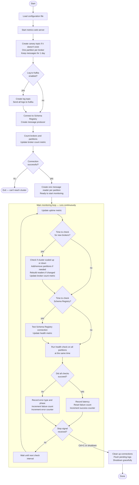
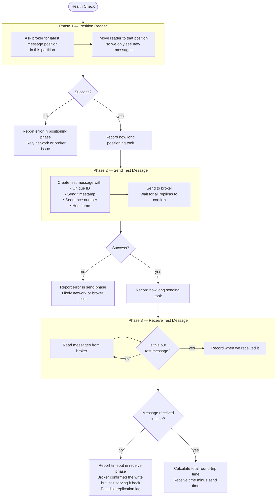
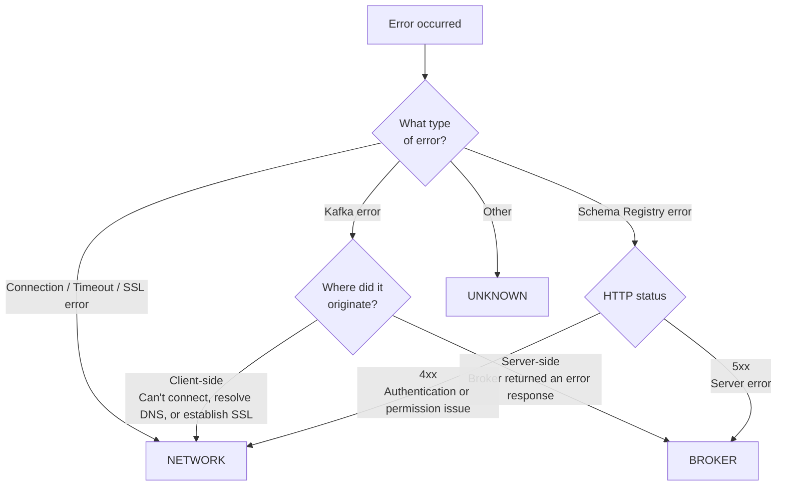

# cloud_canary

A prototype Kafka canary for monitoring the end-to-end health of a
[Confluent Cloud](https://confluent.cloud) cluster. It produces a small
Avro-encoded message, consumes it back, and records the round-trip latency and any
errors as Prometheus metrics — giving you an always-on signal of cluster availability,
replication health, and network connectivity.

> [!WARNING]
> Cloud Canary is an experimental prototype, not a Confluent-supported product.
> It is provided without warranties or support commitments. If you download or
> deploy it in a production environment, you do so at your own risk and should
> first perform sufficient security, reliability, scale, failure-mode, and
> operational testing for your environment.

The implementation uses the stable `Producer` and `Consumer` APIs with manual
Avro serialization rather than the experimental `SerializingProducer` and
`DeserializingConsumer` APIs.

---

## Quick Start

```bash
# 1. Create and activate a virtual environment
python3 -m venv .venv && source .venv/bin/activate   # Windows: .venv\Scripts\activate

# 2. Install dependencies
pip install -r requirements.txt

# 3. Configure credentials
cp config/config.ini.template config/config.ini
# Edit config/config.ini — fill in endpoints and usernames, then configure the
# file-backed Kafka and Schema Registry secret sources.

# 4. Run the canary (from project root)
python -m src.main

# 5. (Optional) Start the development-only monitoring stack separately.
#    Docker and Docker Compose V2 must already be installed and running.
docker compose -f monitoring/docker-compose.yml up -d
# Prometheus: http://localhost:9090   Grafana: http://localhost:3000
# Grafana's admin/admin credential is for local development only.
```

> `config/config.ini` is git-ignored — never commit it.

---

## Table of Contents

1. [What It Does](#what-it-does)
2. [How It Works](#how-it-works)
   - [Main Loop](#main-loop)
   - [check_kafka Phases](#check_kafka-phases)
   - [Error Classification](#error-classification)
3. [Project Structure](#project-structure)
4. [Prerequisites](#prerequisites)
5. [Setup](#setup)
6. [Configuration Reference](#configuration-reference)
7. [Running the Canary](#running-the-canary)
8. [Running Multiple Instances](#running-multiple-instances)
9. [Prometheus Metrics](#prometheus-metrics)
10. [Monitoring Stack](#monitoring-stack-prometheus--grafana)
11. [Troubleshooting](#troubleshooting)

---

## What It Does

| Capability | Detail |
|---|---|
| **End-to-end latency** | Measures produce → broker ack → consumer receive round-trip in ms, per partition |
| **Per-partition coverage** | One check per topic partition runs concurrently, up to the configured worker limit. Partition count is reconciled to broker count, but Kafka leader placement is not controlled or verified, so distinct coverage of every broker is not guaranteed. |
| **Phase attribution** | Distinguishes failures in the SEEK, PRODUCE, and CONSUME phases |
| **Error classification** | Labels failures as NETWORK (client-side) or BROKER (server-side) |
| **Topic management** | Auto-creates the canary topic; resizes partitions when the cluster scales |
| **Schema Registry health** | Independently probes SR on its own cadence |
| **Prometheus metrics** | Exposes latency histograms, counters, and gauges at `/metrics` |
| **Kafka log capture** | Optionally publishes all canary logs to a Kafka topic for long-term retention |
| **Grafana dashboard** | Pre-built dashboard provisioned automatically via Docker Compose |
| **Multi-instance safe** | Multiple instances run concurrently without interfering — each uses a unique consumer group and `host`-labelled metrics |

---

## How It Works

### Main Loop

The canary uses a single control loop for three check cadences. Per-partition
Kafka checks run in a worker pool, up to `max.workers` at a time:



### check_kafka Phases

Each check runs three sequential phases. The duration of SEEK and PRODUCE are timed
independently so you can isolate where latency is coming from.



> **How receive timeouts are reported:** By the time the consume phase starts, the
> producer has received a successful acknowledgement for the message. The prototype
> currently classifies a later receive timeout as a broker-side failure. In practice,
> a consume-path network problem can also cause this symptom, so investigate both the
> cluster and client connectivity.

### Error Classification

Every failure is labelled by the phase where it occurred and classified into one of
two categories based on where the error originated.



| Category | Meaning | Examples |
|---|---|---|
| **NETWORK** | Client could not reach the endpoint (TCP / DNS / TLS layer) | Broker unreachable, DNS failure, expired TLS cert, VPN drop |
| **BROKER** | Broker received the request but returned an error | ISR degradation, quota exceeded, leader not available |
| **UNKNOWN** | Could not be classified | Unexpected exception type |

---

## Project Structure

```
cloud_canary/
├── config/
│   ├── config.ini              # Your credentials — git-ignored, never commit this
│   └── config.ini.template     # Checked-in template with all available options
│
├── monitoring/                 # Local Prometheus + Grafana stack
│   ├── docker-compose.yml
│   ├── prometheus/
│   │   └── prometheus.yml      # Scrape config pointing at host:8000
│   └── grafana/
│       ├── provisioning/
│       │   ├── datasources/
│       │   │   └── prometheus.yml    # Auto-wires Prometheus as default datasource
│       │   └── dashboards/
│       │       └── provider.yml      # Tells Grafana where to load dashboards from
│       └── dashboards/
│           └── cloud_canary.json     # Pre-built dashboard, loaded automatically
│
├── src/
│   ├── __init__.py
│   ├── config.py               # INI loader — returns kafka / schema_registry / app dicts
│   ├── consumer.py             # Consumer + AvroDeserializer, seek_to_end(), consume_canary()
│   ├── error_classifier.py     # Phase enum, ErrorCategory enum, CanaryError exception
│   ├── kafka_log_handler.py    # logging.Handler that publishes JSON records to Kafka
│   ├── main.py                 # Entry point: startup, main loop, signal handling
│   ├── metrics.py              # All Prometheus metric definitions
│   ├── producer.py             # Producer + AvroSerializer, produce_canary()
│   ├── schema.py               # Avro schema string, CanaryMessage dataclass
│   └── topic.py                # ensure_topic(), sync_topic_partitions()
│
├── .gitignore
├── requirements.txt
└── README.md
```

---

## Prerequisites

| Requirement | Notes |
|---|---|
| Python **3.10+** | Required — the code uses `X \| Y` union syntax introduced in 3.10. `python3 --version` to check. |
| pip | Comes with Python |
| A Confluent Cloud cluster | Dedicated or Basic tier both work |
| Kafka API key + secret | Needs `TOPIC:CREATE`, `TOPIC:WRITE`, `TOPIC:READ` ACLs on `cloud-canary*` |
| Schema Registry API key + secret | Needs `SUBJECT:READ` and `SUBJECT:WRITE` on `com.cloud.canary*` |
| Docker + Docker Compose V2 | Only required for the optional local monitoring workflow. Uses `docker compose` (space, not hyphen). Install and start the runtime yourself before using the explicit monitoring commands; the project never manages the external runtime. |

---

## Setup

### 1. Create and activate a virtual environment

```bash
cd cloud_canary/
python3 -m venv .venv
source .venv/bin/activate        # Windows: .venv\Scripts\activate
```

### 2. Install dependencies

```bash
pip install -r requirements.txt
```

`requirements.txt` installs:
- `confluent-kafka[avro]` — librdkafka Python bindings with Avro/Schema Registry support
- `prometheus_client` — Prometheus metrics HTTP server

> **Linux note:** `confluent-kafka` bundles `librdkafka` in the wheel for most x86_64
> Linux distributions. On ARM Linux (Graviton, Raspberry Pi, etc.) pip may attempt to
> build from source, which requires `librdkafka-dev` and a C compiler:
> ```bash
> # Debian/Ubuntu
> sudo apt install librdkafka-dev build-essential
> # RHEL/Amazon Linux
> sudo yum install librdkafka-devel gcc
> ```
> On macOS and Windows the wheel is always pre-built — no extra steps needed.

### 3. Configure credentials

```bash
cp config/config.ini.template config/config.ini
```

Open `config/config.ini` and fill in your Confluent Cloud credentials:

For production, mount secrets as files and set `sasl.password.file` and
`basic.auth.user.info.file` to those paths. Use `ssl.key.password.file` when a
password-protected Kafka client key is configured. Each `.file` setting is
mutually exclusive with its inline counterpart. A fully secret-mounted INI is
also supported; direct secret environment variables are not recommended.

```ini
[kafka]
bootstrap.servers=pkc-xxxxx.us-east-1.aws.confluent.cloud:9092
security.protocol=SASL_SSL
sasl.mechanisms=PLAIN
sasl.username=YOUR_KAFKA_API_KEY
sasl.password=YOUR_KAFKA_API_SECRET

[schema_registry]
url=https://psrc-xxxxx.us-east-2.aws.confluent.cloud
basic.auth.user.info=SR_API_KEY:SR_API_SECRET

[app]
topic=cloud-canary
consumer.timeout.seconds=5
check.interval.seconds=15
```

> `config/config.ini` is listed in `.gitignore`. **Never commit it.**

---

## Configuration Reference

### `[kafka]` — librdkafka connection and authentication

These keys are passed directly to the librdkafka client. Key names must match
[librdkafka's configuration properties](https://github.com/confluentinc/librdkafka/blob/master/CONFIGURATION.md) exactly.

| Key | Required | Description |
|---|---|---|
| `bootstrap.servers` | Yes | Confluent Cloud bootstrap endpoint (`pkc-xxxxx...confluent.cloud:9092`) |
| `security.protocol` | Yes | Must be `SASL_SSL` for Confluent Cloud |
| `sasl.mechanisms` | Yes | Must be `PLAIN` for Confluent Cloud |
| `sasl.username` | Yes | Kafka API key |
| `sasl.password` | Yes | Kafka API secret |
| `enable.ssl.certificate.verification` | **Recommended** | Enable strict SSL certificate verification (`true` by default). **NEVER set to `false` in production** — this disables MITM protection. |
| `ssl.ca.location` | No | Path to custom CA certificate bundle (PEM format). If not set, uses system default CA bundle (`/etc/ssl/certs/ca-certificates.crt`). Required for corporate/private CAs. |
| `ssl.certificate.location` | No | Path to client certificate for mutual TLS (mTLS). Requires `ssl.key.location`. |
| `ssl.key.location` | No | Path to client private key for mutual TLS (mTLS). Requires `ssl.certificate.location`. |
| `ssl.key.password` | No | Password for encrypted private key file (if `ssl.key.location` uses encrypted key). |

> **🔒 SSL/TLS Security:** Cloud Canary validates SSL certificates at startup to prevent man-in-the-middle attacks. If certificate validation fails, the application exits immediately with a clear error message. Always use `enable.ssl.certificate.verification=true` (default) in production.

### `[schema_registry]` — Confluent Schema Registry

| Key | Required | Description |
|---|---|---|
| `url` | Yes | Schema Registry endpoint (`https://psrc-xxxxx...confluent.cloud`) |
| `basic.auth.user.info` | Yes | `SR_API_KEY:SR_API_SECRET` (colon-separated) |

### `[app]` — Canary behaviour

| Key | Default | Description |
|---|---|---|
| `topic` | `cloud-canary` | Kafka topic used for canary messages. Created automatically at startup. |
| `consumer.timeout.seconds` | `5` | Max seconds to wait for the canary message before treating the consume phase as failed. |
| `check.interval.seconds` | `15` | Seconds to wait after one complete check cycle before starting the next. A cycle can take longer than this value, especially when partition count exceeds `max.workers`. |
| `partition.sync.interval.seconds` | `86400` | How often to check for broker count changes and resize the topic. |
| `sr.check.interval.seconds` | `60` | How often to run an independent Schema Registry health probe. |
| `sr.check.timeout.seconds` | `10` | Maximum duration of startup and periodic Schema Registry probes. Must be greater than `0` and less than `sr.check.interval.seconds`. |
| `metrics.port` | `8000` | TCP port for the Prometheus `/metrics` HTTP endpoint. |
| `metrics.bind.address` | `0.0.0.0` | IP address to bind the metrics HTTP server to. Use `0.0.0.0` for all interfaces (default), `127.0.0.1` for localhost only, or a specific IP to bind to a single network interface. |
| `metrics.ssl.enabled` | `false` | Enable HTTPS/TLS for the metrics endpoint. Requires `metrics.ssl.cert` and `metrics.ssl.key` to be configured. Useful for production environments where metrics contain sensitive labels. |
| `metrics.ssl.cert` | — | Path to SSL certificate file in PEM format. Required when `metrics.ssl.enabled=true`. |
| `metrics.ssl.key` | — | Path to SSL private key file in PEM format. Required when `metrics.ssl.enabled=true`. |
| `log.topic.enabled` | `false` | Set to `true` to publish all canary logs as JSON to a Kafka topic. |
| `log.topic` | `cloud-canary-logs` | Topic name for log capture. Created automatically if enabled. |
| `log.topic.retention.ms` | `604800000` | Log topic retention period in milliseconds (default: 7 days). |
| `warmup.checks` | `2` | Number of initial completed attempts per partition treated as warmup and omitted from `canary_e2e_latency_ms`. After warmup, every expected partition must record a successful check before initial readiness. With `0`, each partition's first check is eligible as its post-warmup success and all observations are recorded. |
| `max.workers` | `20` | Maximum number of concurrent worker threads for partition checks. Each thread uses ~8MB stack memory. Formula: `actual_workers = min(partition_count, max.workers)`. Increase for large clusters (100+ partitions) to reduce check cycle time. Typical values: 10-20 (small), 30-50 (large), 50-100 (huge clusters with spare memory). |

> **Canary topic retention** is fixed at **1 day (86400000 ms)** and is not configurable via `config.ini`. It is set at topic creation time. If the topic already exists, update it manually:
> ```bash
> confluent kafka topic update cloud-canary --config retention.ms=86400000
> ```

---

## Running the Canary

### Python workflow

```bash
# From the project root, with the virtual environment active:
python -m src.main
```

The application uses whichever supported Python environment you activate; it
does not depend on a repository-specific virtual-environment path. Set
`CANARY_INSTANCE_ID` in the environment if an explicit instance ID is needed.
The optional monitoring stack is an independent workflow documented under
[Monitoring Stack](#monitoring-stack-prometheus--grafana).

### Versioned OCI-image workflow

The container is a convenient evaluation and deployment format; it does not make
the prototype production-ready. Apply the warning at the top of this README and
validate the image and operating model before using it in a production environment.

```bash
# Build the Docker image from the authoritative application version.
VERSION="$(python -c 'from src.__version__ import __version__; print(__version__)')"
REVISION="$(git rev-parse HEAD)"
CREATED="$(date -u +%Y-%m-%dT%H:%M:%SZ)"
docker build \
  --build-arg VERSION="$VERSION" \
  --build-arg REVISION="$REVISION" \
  --build-arg CREATED="$CREATED" \
  -t "cloud-canary:$VERSION" .

# Run with mounted config file
docker run --rm \
  -v $(pwd)/config/config.ini:/app/config/config.ini:ro \
  -p 8000:8000 \
  cloud-canary:1.2.3

# Run with custom instance ID (for multi-instance deployments)
docker run --rm \
  -e CANARY_INSTANCE_ID=canary-us-east-1 \
  -v $(pwd)/config/config.ini:/app/config/config.ini:ro \
  -p 8000:8000 \
  cloud-canary:1.2.3

# Run in background (detached mode)
docker run -d \
  --name cloud-canary \
  --restart unless-stopped \
  -v $(pwd)/config/config.ini:/app/config/config.ini:ro \
  -p 8000:8000 \
  cloud-canary:1.2.3

# View logs
docker logs -f cloud-canary

# Stop the container
docker stop cloud-canary
```

These required build arguments populate the OCI source, version, revision, and
creation labels. The build rejects missing or malformed provenance, a version
that differs from `src/__version__.py`, or native dependencies that cannot be
imported on the selected build platform. No multi-architecture image support is
currently claimed; each architecture must complete build, startup, native
dependency import, and the configured liveness probe before it is documented or
published as supported.

**Docker Compose example:**

```yaml
version: '3.8'
services:
  cloud-canary:
    image: cloud-canary:1.2.3
    container_name: cloud-canary
    restart: unless-stopped
    environment:
      - CANARY_INSTANCE_ID=canary-prod-1
    volumes:
      - ./config/config.ini:/app/config/config.ini:ro
    ports:
      - "8000:8000"
    healthcheck:
      test: ["CMD", "python", "-c", "import urllib.request; urllib.request.urlopen('http://localhost:8000/metrics')"]
      interval: 30s
      timeout: 5s
      retries: 3
```

> **DNS troubleshooting:** Run the image with the `diagnose` command to inspect
> container DNS, or configure DNS with Docker's `--dns` option or the Compose
> service's `dns` setting. The example Compose file does not set custom DNS servers.

### Log output format

Text mode emits messages like the following. JSON mode uses the same message
names and adds structured fields such as `host`, `version`, `partition`,
`check_sequence`, and `latency_ms`.

```
2026-03-27T12:00:00 [INFO] cloud_canary started
2026-03-27T12:00:00 [INFO] Metrics server started
2026-03-27T12:00:00 [INFO] Cluster has 3 broker(s).
2026-03-27T12:00:00 [INFO] Topic 'cloud-canary' already exists (3 partition(s)) — skipping creation.
2026-03-27T12:00:00 [INFO] Running initial partition sync
2026-03-27T12:00:01 [INFO] Per-partition consumers ready
2026-03-27T12:00:01 [INFO] Schema Registry check succeeded
2026-03-27T12:00:01 [INFO] Warmup check succeeded (latency not recorded)
2026-03-27T12:00:16 [INFO] Warmup complete, latency metrics enabled
2026-03-27T12:00:31 [INFO] Check succeeded
2026-03-27T12:02:02 [ERROR] Check failed
```

| Log line | Meaning |
|---|---|
| `Per-partition consumers ready` | Startup complete; one consumer is assigned per partition |
| `Warmup check succeeded (latency not recorded)` | Warmup check succeeded; E2E latency was not recorded |
| `Warmup complete, latency metrics enabled` | Configured warmup period finished |
| `Check succeeded` | Check succeeded and E2E latency was recorded |
| `Check failed` | A check failed; structured fields identify partition, phase, category, and streak |
| `Schema Registry check succeeded` | Schema Registry probe succeeded |
| `Schema Registry check failed` | Schema Registry probe failed |

### Graceful shutdown

Send `SIGINT` (Ctrl-C) or `SIGTERM` (container stop). The canary finishes the
current check, closes the consumer cleanly (leaves the group), flushes any buffered
log records to Kafka, then exits.

```bash
# Ctrl-C in the terminal, or:
kill -SIGTERM <pid>
```

---

## Running Multiple Instances

Multiple instances of the canary can run concurrently — for example, one per region or
one per host — without interfering with each other. The following concerns have all been
addressed:

### Independent produce/consume

Each instance uses a randomly generated UUID as its Kafka consumer group ID, so consumer
groups never overlap. Canary messages are matched by the UUID embedded in each message, so
a message produced by instance A is never mistaken for a message produced by instance B.

### Topic management collisions

Topic creation and partition sync operations are safe to run concurrently from multiple
instances:

| Operation | Race condition | How it's handled |
|---|---|---|
| `ensure_topic()` at startup | Two instances both see the topic missing and call `create_topics()` | The second instance receives `TOPIC_ALREADY_EXISTS` and treats it as success |
| `ensure_log_topic()` at startup | Same as above | Same handling |
| `sync_topic_partitions()` scale-up | Two instances call `create_partitions()` simultaneously | The failing instance re-fetches metadata; if the partition count is already correct it logs and skips |
| `sync_topic_partitions()` scale-down delete | Two instances both try to delete the topic | The second `delete_topics()` call returns `UNKNOWN_TOPIC_OR_PART`; the instance falls through to the propagation wait |
| `sync_topic_partitions()` scale-down recreate | During propagation wait, the topic reappears (another instance recreated it) | If the reappeared topic has the correct partition count, recreation is skipped |

### Metrics port

Each instance must use a distinct `metrics.port` so the Prometheus HTTP servers do not
conflict. Configure this in each instance's `config.ini`:

```ini
# Instance 1
metrics.port=8000

# Instance 2
metrics.port=8001
```

### Distinguishing instances in Prometheus and Grafana

Every metric carries a `host` label set to `socket.gethostname()` at startup. Filter or
aggregate by instance using this label:

```promql
# Show only instance on host "us-east-canary"
canary_partition_consecutive_failures{host="us-east-canary"}

# Compare consecutive failures across all instances
canary_partition_consecutive_failures
```

If multiple instances run on the same physical host with the same hostname, set a unique
identifier using the `CANARY_INSTANCE_ID` environment variable:

```bash
# Multiple instances on the same host
CANARY_INSTANCE_ID=canary-us-east python -m src.main &
CANARY_INSTANCE_ID=canary-eu-west python -m src.main &

# Docker example
docker run -e CANARY_INSTANCE_ID=canary-prod-1 ...

# Kubernetes example
env:
  - name: CANARY_INSTANCE_ID
    value: "canary-prod-1"
```

---

## Prometheus Metrics

The canary exposes metrics at `http://localhost:8000/metrics` (port configurable).

> **`host` label** — Every metric carries a `host` label set to `socket.gethostname()` at
> startup. This makes every time series unambiguously tied to the specific canary instance
> that produced it, which is essential when multiple instances run concurrently.

### Latency histograms

Kafka latency histograms carry only `host` labels (partition labels removed to prevent
Prometheus cardinality explosion on large clusters). Schema Registry latency carries
only `host` as it is not partition-specific.

**Note**: Per-partition latency is not available by design. On a 100-partition cluster,
per-partition labels would create 2,200+ time series per canary instance. Use aggregated
metrics and rely on broker-level monitoring for partition-specific troubleshooting.

| Metric | Labels | Description | Bucket boundaries (ms) |
|---|---|---|---|
| `canary_e2e_latency_ms` | `host` | End-to-end latency aggregated across all partitions (produce timestamp → consumer receive) | 10 25 50 100 250 500 1000 2500 5000 10000 |
| `canary_seek_duration_ms` | `host` | Time to fetch high-watermark offset and seek (aggregated across all partitions) | 1 5 10 25 50 100 250 500 |
| `canary_produce_duration_ms` | `host` | Time from `produce()` call to delivery callback (aggregated across all partitions) | 5 10 25 50 100 250 500 1000 2500 |
| `canary_sr_latency_ms` | `host` | Schema Registry health check response time (HTTP round-trip for `get_subjects()`) | 1 5 10 25 50 100 250 500 1000 2500 |

### Counters

Per-partition counters use numeric partition labels at every topology size. Their
label sets are deliberately bounded so series count grows linearly.

| Metric | Labels | Description |
|---|---|---|
| `canary_checks_total` | `host`, `result` (`success`\|`failure`) | Aggregate check attempts |
| `canary_partition_checks_total` | `host`, `partition`, `result` (`success`\|`failure`) | Per-partition check attempts with bounded result values |
| `canary_failures_total` | `host`, `phase`, `category`, `recoverability` | Aggregate failures by bounded classification |
| `canary_sr_checks_total` | `result` (`success`\|`failure`), `host` | Schema Registry health check attempts |

### Gauges

| Metric | Labels | Description |
|---|---|---|
| `canary_partition_consecutive_failures` | `host`, `partition` | Current streak of consecutive failures |
| `canary_partition_last_success_timestamp_seconds` | `host`, `partition` | Unix timestamp of the last successful check |
| `canary_partition_current_state` | `host`, `partition`, `state` | Current bounded health state; obsolete state children are removed |
| `canary_broker_count` | `host` | Broker count as of the last partition sync |
| `canary_topic_partition_count` | `host` | Canary topic partition count as of the last partition sync |
| `canary_uptime_seconds` | `host` | Seconds since the canary process started |
| `canary_check_sequence` | `host` | Sequence number of the last check cycle — gaps indicate restarts |

### Useful PromQL queries

```promql
# Check success rate over the last 5 minutes for a specific host (all partitions)
sum(rate(canary_checks_total{result="success", host="my-host"}[5m]))
  / sum(rate(canary_checks_total{host="my-host"}[5m])) * 100

# Check success rate across all instances by partition
sum by (host, partition) (rate(canary_partition_checks_total{result="success"}[5m]))
  / sum by (host, partition) (rate(canary_partition_checks_total[5m])) * 100

# p95 end-to-end latency per host (partition labels not available on histograms)
histogram_quantile(0.95, sum by (host, le) (rate(canary_e2e_latency_ms_bucket[5m])))

# Aggregate failure rate by phase and category
sum by (host, phase, category) (rate(canary_failures_total[5m]))

# Alert: 3 or more consecutive failures on any partition of any instance
canary_partition_consecutive_failures >= 3

# Alert: Canary monitoring is stale (no successful check in 5+ minutes)
# Detects when the canary process itself is stuck or stopped
(time() - canary_partition_last_success_timestamp_seconds) > 300
```

---

## Health Endpoints

In addition to `/metrics`, the canary provides health check endpoints for load balancers, Kubernetes, and monitoring systems:

### `/health` — Dependency Health

**Purpose**: Report the prototype's current view of Kafka check health. Because
dependency degradation returns HTTP 503, do not use this endpoint as a
process-only liveness probe unless restarting on an external Kafka outage is the
behavior you explicitly want.

**Returns**:
- `200 OK` — Healthy (all checks passing, recent successes)
- `503 Service Unavailable` — Degraded or Unhealthy

**Response Format**:
```json
{
  "status": "healthy",
  "timestamp": "2026-03-27T20:00:00Z",
  "uptime_seconds": 3600.5,
  "message": "Healthy - all checks passing",
  "checks": {
    "max_staleness_seconds": 15.2,
    "failure_rate": 0.0,
    "total_checks": 240,
    "broker_count": 18,
    "schema_registry_healthy": true
  }
}
```

**Status Determination**:
- **HEALTHY** (200): Last success < 60s ago, low failure rate
- **DEGRADED** (503): Last success within 5 minutes, or high failure rate
- **UNHEALTHY** (503): No successful checks in 5+ minutes

**Usage**:
```bash
# Check health
curl http://localhost:8000/health

# Use in Docker Compose
healthcheck:
  test: ["CMD", "curl", "-f", "http://localhost:8000/health"]
  interval: 30s
  timeout: 5s
  retries: 3

# Use in Kubernetes as a readiness-style dependency check
readinessProbe:
  httpGet:
    path: /health
    port: 8000
  initialDelaySeconds: 30
  periodSeconds: 10
```

### `/ready` — Readiness Probe

**Purpose**: Determine whether initial Schema Registry validation and
per-partition warmup are complete.

**Returns**:
- `200 OK` — Ready (initial Schema Registry validation and partition checks completed)
- `503 Service Unavailable` — Not ready (initialization is incomplete)

**Response Format**:
```json
{
  "status": "ready",
  "timestamp": "2026-03-27T20:00:00Z",
  "message": "Ready - all partitions passed a post-warmup check",
  "checks": {
    "schema_registry_validated": true,
    "incomplete_partitions": [],
    "warmup_remaining": {}
  }
}
```

**Status Determination**:
- Before readiness is first achieved, **READY** requires successful initial
  Schema Registry validation and a successful post-warmup check from every
  expected Kafka partition. Exactly the first
  `warmup.checks` completed attempts for each partition are warmup; completing
  them alone is not sufficient. With `warmup.checks=0`, that partition's first
  successful check can satisfy the post-warmup requirement.
- `incomplete_partitions` and `warmup_remaining` identify initialization work
  still outstanding. A failed eligible check leaves its
  partition incomplete until a later check succeeds.
- Once achieved, readiness remains latched across external Kafka or Schema
  Registry failures; those failures are reported by `/health`. Adding an
  expected partition makes readiness incomplete until that partition succeeds
  after its own warmup attempts.

**Usage**:
```bash
# Check readiness
curl http://localhost:8000/ready

# Use in Kubernetes
readinessProbe:
  httpGet:
    path: /ready
    port: 8000
  initialDelaySeconds: 10
  periodSeconds: 5
```

### Endpoint Comparison

| Endpoint | Purpose | Use Case |
|----------|---------|----------|
| `/metrics` | Prometheus metrics exposition | Monitoring, alerting, dashboards |
| `/health` | Kafka dependency-health summary | Monitoring and alerting; returns 503 for degraded dependencies |
| `/ready` | Initialization probe | Gates startup on initial Schema Registry validation and every partition's successful post-warmup check; external dependency failures are reported by `/health` after readiness latches |

---

## Monitoring Stack (Prometheus + Grafana)

> [!WARNING]
> The pre-configured stack in `monitoring/` is for local development and testing
> only and is unsuitable for production. Its bundled `admin` / `admin` Grafana
> credential is development-only, not production-safe. Published Prometheus and
> Grafana ports bind to loopback by default.

The stack requires an already installed and running Docker-compatible runtime
with Docker Compose V2. Verify prerequisites with `docker compose version` and
`docker info`; failures are non-mutating and identify the missing CLI, Compose
plugin, or unavailable runtime. The project never installs, starts, stops, or
reconfigures the external runtime. The canary process can be started or stopped
independently and must be running on the host for successful scraping (Prometheus scrapes
`host.docker.internal:8000`).

### Start the stack

```bash
docker compose -f monitoring/docker-compose.yml up -d
```

| Service | URL | Credentials |
|---|---|---|
| Prometheus | http://localhost:9090 | — |
| Grafana | http://localhost:3000 | `admin` / `admin` |

The Cloud Canary dashboard is provisioned automatically and opens as the Grafana
home page. No manual import is required.

### Production monitoring boundary

Production deployments must supply an externally managed, secure
Prometheus-compatible scraper and visualization system. The production operator
is responsible for retention, high availability, alerting, access control,
authentication, network isolation, audit requirements, and dashboard security.

Cloud Canary exposes metrics using the pull model; it does not accept or require
a Prometheus server URL and does not push metrics to either the bundled stack or
an enterprise monitoring service. Configure the external scraper to retrieve the
canary's `/metrics` endpoint, with appropriate transport and network controls.

### Stop the stack

```bash
docker compose -f monitoring/docker-compose.yml down  # preserves data volumes
```

### Dashboard panels

| Panel | What it shows |
|---|---|
| **Consecutive Failures** | Current failure streak — color-coded green/yellow/red |
| **Check Success Rate (5m)** | Percentage of recent checks that succeeded |
| **Schema Registry Health (5m)** | SR probe success rate |
| **Staleness (Max)** | Seconds since last successful check — alerts when canary is stuck/stopped |
| **Last Check Latency / p95 / p99** | Recent latency stats, color-coded by threshold |
| **Total Failures (1h)** | Failure count over the past hour |
| **End-to-End Latency** | Time series of p50 / p95 / p99 latency |
| **Seek Duration** | p50 / p95 watermark fetch latency — isolates broker fetch path |
| **Produce Duration** | p50 / p95 produce-to-ack latency — isolates write and replication |
| **Check Rate** | Success vs failure rate over time |
| **Failure Rate by Phase & Category** | Which phase is failing and whether it's NETWORK or BROKER |
| **Consecutive Failures Over Time** | Historical trend of the failure streak gauge |
| **Brokers / Partitions** | Cluster state from last partition sync |

### How Prometheus reaches the canary

Prometheus scrapes `host.docker.internal:8000`, which resolves to the host machine
from inside the Docker network. This works natively on macOS and Windows. On Linux,
the `extra_hosts: ["host.docker.internal:host-gateway"]` entry in `docker-compose.yml`
sets up the equivalent alias.

---

## Securing the Metrics Endpoint

The metrics endpoint can be configured with controls that may be useful when
evaluating a production deployment. It does not provide application-level
authentication or authorization.

### Bind to Localhost Only

Restrict metrics access to the local machine (useful when using a metrics collector on the same host):

```ini
[app]
metrics.bind.address=127.0.0.1
```

Prometheus must then scrape `localhost:8000` instead of the external IP.

### Enable HTTPS/TLS

Encrypt metrics traffic with SSL/TLS certificates:

```ini
[app]
metrics.ssl.enabled=true
metrics.ssl.cert=/etc/ssl/certs/canary.crt
metrics.ssl.key=/etc/ssl/private/canary.key
```

**Generate self-signed certificate for testing:**
```bash
openssl req -x509 -newkey rsa:4096 -nodes \
  -keyout canary.key -out canary.crt \
  -days 365 -subj "/CN=canary.example.com"
```

**Prometheus scrape config for HTTPS:**
```yaml
scrape_configs:
  - job_name: cloud-canary
    scheme: https
    tls_config:
      insecure_skip_verify: true  # Only for self-signed certs
    static_configs:
      - targets: ['canary-host:8000']
```

For any production evaluation, use certificates from a trusted CA (Let's Encrypt,
an internal CA, etc.) and set `insecure_skip_verify: false`.

---

## Troubleshooting

### Config file not found

```
Config file not found: 'config/config.ini'
```

Run `cp config/config.ini.template config/config.ini` and fill in your credentials.
Always launch the canary from the project root so the relative path resolves correctly.

### SASL authentication failure

```
KafkaException: [ERR-8] SASL authentication failed
```

Check that `sasl.username` and `sasl.password` in `[kafka]` are correct. Verify the
API key has not been deleted or revoked in the Confluent Cloud console.

### Startup failed — could not determine partition count

```
Partition sync skipped — could not fetch cluster metadata: ...
Startup failed — could not determine partition count.
```

The canary could not reach the broker at startup. Check:
- `bootstrap.servers` is correct (copy from Confluent Cloud → Cluster → Clients tab)
- Port 9092 is not blocked by a firewall or VPN
- `security.protocol=SASL_SSL` and `sasl.mechanisms=PLAIN` are set

### Consume phase timeout after successful produce

```
FAIL [1] | seq=1 partition=P phase=CONSUME category=BROKER detail=Message not returned within 5s — produce succeeded so broker received it (possible replication lag or ISR issue)
```

The broker acknowledged the write but did not serve it back within the timeout.
Possible causes:
- ISR count has dropped below the minimum (check Confluent Cloud cluster health)
- Replication lag on the partition leader
- Consumer connectivity issue that appeared after the produce completed

Increase `consumer.timeout.seconds` if the cluster is under heavy load, but
sustained occurrences warrant investigating cluster health.

### Schema Registry health check failure

```
SR FAIL | phase=SCHEMA_REGISTRY category=NETWORK detail=...
```

Check:
- `url` in `[schema_registry]` is the correct SR endpoint URL
- `basic.auth.user.info` is in `SR_KEY:SR_SECRET` format (no spaces)
- The SR API key has `SUBJECT:READ` permission

### Topic creation fails (authorization error)

```
Startup failed: Failed to create topic 'cloud-canary': TOPIC_AUTHORIZATION_FAILED
```

The Kafka API key needs `TOPIC:CREATE` ACL on `cloud-canary` (or a prefix ACL on
`cloud-canary*`). Add it in Confluent Cloud → Cluster → ACLs.

### Metrics port already in use

```
OSError: [Errno 48] Address already in use
```

Another process is using the configured port. Options to fix:

1. **Change the port:**
   ```ini
   [app]
   metrics.port=8001
   ```

2. **Bind to a different interface:**
   ```ini
   [app]
   metrics.bind.address=127.0.0.1
   ```

3. **Find and stop the conflicting process:**
   ```bash
   # macOS/Linux
   lsof -i :8000
   # Then kill the process or change its port
   ```

### Monitoring stack cannot reach canary metrics

Verify the canary is running and the metrics endpoint is responding:

```bash
curl http://localhost:8000/metrics | head -20
```

If it responds, but Prometheus shows the target as `DOWN`, check that Docker has
network access to the host on that port (firewall rules, Docker Desktop settings).

### SSL certificate errors

```
Failed to start metrics server: SSL certificate not found: /path/to/cert.pem
```

Check that:
- Certificate and key files exist at the configured paths
- Paths are absolute (not relative)
- Files are readable by the canary process
- Certificate and key are in PEM format

**Test SSL setup:**
```bash
# Verify certificate is valid
openssl x509 -in /path/to/cert.pem -text -noout

# Test HTTPS endpoint
curl -k https://localhost:8000/metrics

# Check Prometheus can scrape (if using self-signed cert)
# Ensure tls_config.insecure_skip_verify: true in prometheus.yml
```
